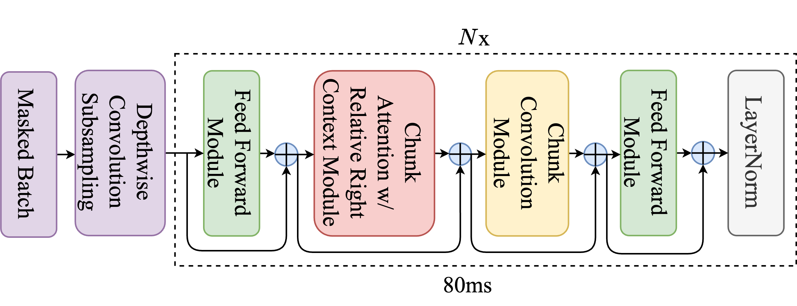

# ChunkFormer: Masked Chunking Conformer For Long-Form Speech Transcription
---

This repository contains the implementation and supplementary materials for our ICASSP 2025 paper, **"ChunkFormer: Masked Chunking Conformer For Long-Form Speech Transcription"**. The paper has been fully accepted by the reviewers with scores: **4/4/4**.

[](https://paperswithcode.com/sota/speech-recognition-on-common-voice-vi)
[](https://paperswithcode.com/sota/speech-recognition-on-vivos)

- [`paper.pdf`](docs/paper.pdf): The ICASSP 2025 paper describing ChunkFormer.
- [`reviews.pdf`](docs/chunkformer_reviews.pdf): Reviewers' feedback from the ICASSP review process.
- [`rebuttal.pdf`](docs/rebuttal.pdf): Our rebuttal addressing reviewer concerns.

## Table of Contents
- [Introduction](#introduction)
- [Key Features](#key-features)
- [Installation](#installation)
- [Usage](#usage)
- [Citation](#citation)
- [Acknowledgments](#acknowledgments)

<a name = "introduction" ></a>
## Introduction
ChunkFormer is an ASR model designed for processing long audio inputs effectively on low-memory GPUs. It uses a **chunk-wise processing mechanism** with **relative right context** and employs the **Masked Batch technique** to minimize memory waste due to padding. The model is scalable, robust, and optimized for both streaming and non-streaming ASR scenarios.


<a name = "key-features" ></a>
## Key Features
- **Transcribing Extremely Long Audio**: ChunkFormer can **transcribe audio recordings up to 16 hours** in length with results comparable to existing models. It is currently the first model capable of handling this duration.
- **Efficient Decoding on Low-Memory GPUs**: Chunkformer can **handle long-form transcription on GPUs with limited memory** without losing context or mismatching the training phase.
- **Masked Batching Technique**: ChunkFormer efficiently **removes the need for padding in batches with highly variable lengths**.  For instance, **decoding a batch containing audio clips of 1 hour and 1 second costs only 1 hour + 1 second of computational and memory usage, instead of 2 hours due to padding.**

| GPU Memory | Total Batch Duration (minutes) |
|---|---|
| 80GB | 980 |
| 24GB | 240 |

<a name = "installation" ></a>
## Installation
#### Checkpoints
| Language | Model |
|----------|-------|
| Vietnamese  | [khanhld/chunkformer-large-vie](https://huggingface.co/khanhld/chunkformer-large-vie) |
| English   | [khanhld/chunkformer-large-en-libri-960h](https://huggingface.co/khanhld/chunkformer-large-en-libri-960h) |


#### Dependencies
To run the implementation, ensure you have an environment with PyTorch working and the following dependencies installed:

```bash
pip install -r requirements.txt
```

<a name = "usage" ></a>
## Usage
#### Training the Model
For training/finetuning, follow this [PR](https://github.com/wenet-e2e/wenet/pull/2723).

#### Long-Form Audio Testing
To test the model with a single [long-form audio file](data/common_voice_vi_23397238.wav). Audio file extensions ".mp3", ".wav", ".flac", ".m4a", ".aac" are accepted:
```bash
python decode.py \
    --model_checkpoint path/to/local/hf/checkpoint/repo \
    --long_form_audio path/to/audio.wav \
    --total_batch_duration 14400 \ #in second, default is 1800
    --chunk_size 64 \
    --left_context_size 128 \
    --right_context_size 128
```
Example Output:
```
[00:00:01.200] - [00:00:02.400]: this is a transcription example
[00:00:02.500] - [00:00:03.700]: testing the long-form audio
```

#### Batch Transcription Testing
The [audio_list.tsv](data/audio_list.tsv) file must have at least one column named **wav**. Optionally, a column named **txt** can be included to compute the **Word Error Rate (WER)**. Output will be saved to the same file.

```bash
python decode.py \
    --model_checkpoint path/to/local/hf/checkpoint/repo \
    --audio_list path/to/audio_list.tsv \
    --total_batch_duration 14400 \ #in second, default is 1800
    --chunk_size 64 \
    --left_context_size 128 \
    --right_context_size 128
```
Example Output:
```
WER: 0.1234
```

---

<a name = "citation" ></a>
## Citation
If you use this work in your research, please cite:

```bibtex
@INPROCEEDINGS{10888640,
  author={Le, Khanh and Ho, Tuan Vu and Tran, Dung and Chau, Duc Thanh},
  booktitle={ICASSP 2025 - 2025 IEEE International Conference on Acoustics, Speech and Signal Processing (ICASSP)}, 
  title={ChunkFormer: Masked Chunking Conformer For Long-Form Speech Transcription}, 
  year={2025},
  volume={},
  number={},
  pages={1-5},
  keywords={Scalability;Memory management;Graphics processing units;Signal processing;Performance gain;Hardware;Resource management;Speech processing;Standards;Context modeling;chunkformer;masked batch;long-form transcription},
  doi={10.1109/ICASSP49660.2025.10888640}}

```

<a name = "acknowledgments" ></a>
## Acknowledgments
We would like to thank Zalo for providing resources and support for training the model. This work was completed during my tenure at Zalo.

This implementation is based on the WeNet framework. We extend our gratitude to the WeNet development team for providing an excellent foundation for speech recognition research and development.

---
